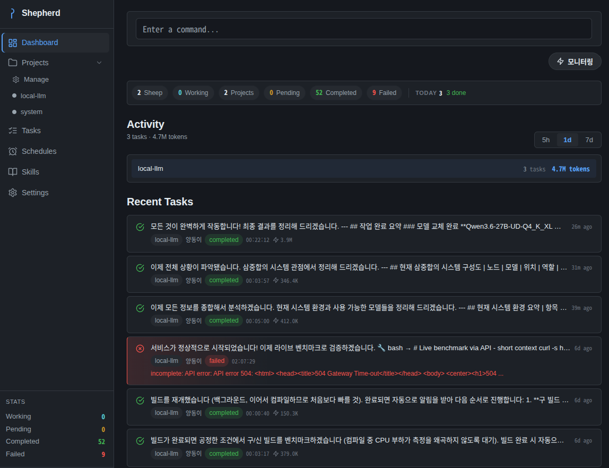
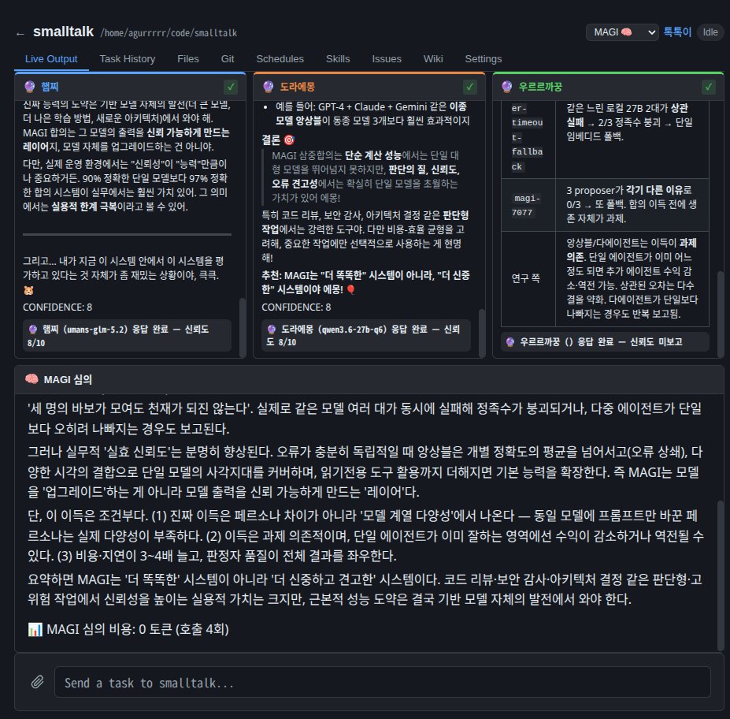

# Shepherd

AI coding orchestration platform that manages a flock of AI coding agents across many projects — like a shepherd tending a flock.

> 한국어 문서는 [README_KO.md](README_KO.md)를 참고하세요.

## Overview

Shepherd runs multiple AI coding agents ("sheep") in parallel across different codebases, routes tasks to the right worker, streams their live output, and keeps a full task history. It is built around a **Web UI + daemon** and speaks to a wide range of AI backends — cloud CLIs, self-hosted local models, and a built-in multi-model consensus engine (MAGI).



Three ways to drive it:

- **Web UI** *(primary)* — Full dashboard with real-time streaming, task management, project git views, file browser, issues, wiki, schedules, and skills
- **MCP Server** — Integrate with Claude Desktop / other MCP clients
- **CLI** — Direct commands and a legacy interactive/TUI mode

### Core Concepts

- **Shepherd (Manager)** — Analyzes each task and routes it to the right worker
- **Sheep (Workers)** — Individual AI agent instances, each assigned to a project and a provider
- **Projects** — Codebases the sheep work on
- **Providers** — The AI backend a sheep uses (Claude, OpenCode, Pi, Grok, Embedded, MAGI)
- **Sheep Personal Memory** — Per-sheep notes under `~/.shepherd/sheep/<name>/` that follow the sheep across projects (moments, bonds, voice)

## Providers

Shepherd is multi-provider. Each sheep runs one provider; you can mix providers across your flock and switch per sheep at any time.

| Provider | Backend | Auth / Setup | Best for |
|----------|---------|--------------|----------|
| `claude` | Claude Code CLI | CLI handles its own login | Default — code writing, complex agentic tasks |
| `opencode` | OpenCode CLI | CLI config | Reviews, web search, cheaper/local models |
| `pi` | Pi coding agent CLI (`pi --print --mode json`) | CLI config | Claude-class general coding harness |
| `grok` | Grok / xAI CLI (`grok --output-format streaming-json`) | CLI config | Claude-class harness on xAI models |
| `embedded` | In-process local LLM agent loop | Configured endpoints (URL + key) | Self-hosted models (llama.cpp, vLLM, Ollama) with no extra subprocess |
| `magi` | Multi-model consensus engine | Composes the providers above | High-stakes advisory questions needing cross-model agreement |
| `auto` | Auto-select | — | Let the manager pick the best provider from the prompt |

Cloud CLI providers (`claude`, `opencode`, `pi`, `grok`) manage their own authentication — **no API keys live in Shepherd**. The `embedded` provider talks directly to LLM HTTP endpoints you configure, and MAGI composes any of the above.

Each provider can be enabled/disabled globally (`provider_enabled_*`) and given a default model (`model_*`) in Settings.

### Embedded Provider (local models, in-process)

The embedded provider runs a full tool-using agent loop **inside the Shepherd process** — no CLI subprocess. It speaks the OpenAI-compatible chat API, so it drives any local server (llama.cpp, vLLM, Ollama, LM Studio, …).

- Configure endpoints in the Web UI (**Settings → Embedded**): base URL, API key, model, context window, max iterations
- Per-endpoint flags: `thinking` (reasoning mode) and `vision` (surface image files to vision-capable models)
- Native tools: `read_file`, `write_file`, `edit_file`, `grep`, `glob`, `bash`, plus all Shepherd MCP tools (browser automation, wiki, history, external MCP servers)
- Endpoint config lives in `~/.shepherd/embedded.yaml`; API keys are masked in API responses
- Context management: rune-aware token estimation, history trimming, and optional **context handoff** (summarize + enqueue a follow-up task when the window is full)

### MAGI — Multi-Model Consensus

MAGI is a deliberation engine inspired by the three-way MAGI system: it asks **three proposers** the same question in parallel, each wearing a distinct persona, then a separate **aggregator** judges and synthesizes a single answer. Low agreement escalates to an anonymized **debate round** before a final verdict.

```
Task → Orchestrator
        ├─ Proposer ×3 (parallel, persona-assigned)
        │    └─ each self-rates confidence (0–10)
        ├─ Aggregator (judge/synthesis)
        │    ├─ agreement ≥ threshold → return synthesis
        │    └─ agreement < threshold → Debate
        ├─ Debate (anonymized, 1 round)
        │    └─ re-judge → consensus or deadlock
        └─ result + cost (tokens / calls)
```

- **Personas**: `MELCHIOR-1` (scientist — technical precision), `BALTHASAR-2` (mother — conservatism & safety), `CASPER-3` (woman — practicality & user perspective), or a `custom` persona
- **Proposer backends**: each proposer can be `embedded`, `claude_cli`, `opencode_cli`, or `grok_cli` — mixing model *families* is strongly recommended (correlated errors destroy consensus value)
- **Aggregator backend**: `claude_cli`, `opencode_cli`, `grok_cli`, or an embedded `endpoint`
- **Tool policy (proposers)**:
  - **Allowed (read-only)**: `read_file`, `grep`, `glob`, history/wiki, read-only external MCP tools
  - **Allowed (browser)**: full browser automation (`browser_open`, `browser_click`, `browser_type`, …) with **per-proposer isolated sessions**
  - **Blocked**: file writes, bash, and other mutating cluster/FS tools
- **Mode**: `advisory` (Phase 1) — best for high-stakes questions ("is this design sound?", "what's the root cause?"), not autonomous execution
- Configure in the Web UI (**Settings → MAGI**); persisted under the `magi` section of `~/.shepherd/embedded.yaml`



> MAGI is advisory-only: it does not execute plans or edit code. Use it to get a well-vetted answer, then hand the plan to a coding provider.

## Requirements

- **Go 1.25+** (to build)
- **Node.js 18+** (to build the Web UI)
- At least one provider backend:
  - **Claude Code CLI** (default), and/or **OpenCode**, **Pi**, **Grok** CLIs in `PATH`
  - and/or a local **OpenAI-compatible LLM endpoint** for the embedded provider

## Installation

### Quick Install

```bash
git clone https://github.com/agurrrrr/shepherd.git
cd shepherd

# First time only: install Web UI dependencies
cd web && npm install && cd ..

./install.sh
```

`install.sh` builds the Svelte frontend (`npm run build` — assumes `node_modules` already present), embeds it into the Go binary, installs to `~/.local/bin/`, and restarts the daemon.

### Manual Build

```bash
cd web && npm install && npm run build && cd ..   # build the embedded Web UI
go build -o shepherd ./cmd/shepherd
cp shepherd ~/.local/bin/
```

## Quick Start

```bash
# 1. Register the current directory as a project
shepherd init

# 2. Set up Web UI authentication (username + password)
shepherd auth setup

# 3. Start the daemon
shepherd serve -d

# 4. Open the Web UI
#    http://localhost:8585
```

From the Web UI you can spawn sheep, assign them to projects, pick a provider, and submit tasks — all with live streaming output. You can also fire a one-off task straight from the CLI:

```bash
shepherd "Add a login feature to the app"
```

---

## Web UI

The Web UI is a Svelte SPA embedded in the Go binary. After starting the daemon it is served at `http://localhost:8585`.

### Pages

| Page | Path | Description |
|------|------|-------------|
| Dashboard | `/` | Sheep status cards, running tasks, command input, live output |
| Sheep | `/sheep` | Create, delete, assign, and change a sheep's provider/model |
| Projects | `/projects` | Project list and management |
| Project Detail | `/projects/:name` | Tabs: **Live Output**, **Task History**, **Files**, **Git**, **Schedules**, **Skills**, **Issues**, **Wiki**, **Settings** |
| Tasks | `/tasks` | Task list with filtering and search |
| Task Detail | `/tasks/:id` | Full output, modified files, cost, error details, retry |
| Schedules | `/schedules` | Cron / interval schedule management |
| Skills | `/skills` | Skill creation, import/export, sync to projects |
| Settings | `/settings` | Language, providers, models, Embedded endpoints, MAGI, Discord, wiki, OpenCode thinking proxy |
| Login | `/login` | Authentication |

### Project Detail Tabs

| Tab | What it does |
|-----|----------------|
| Live Output | Streamed agent output for the running task (including MAGI multi-stream) |
| Task History | Past tasks for this project |
| Files | In-browser project file explorer (toggle with `enable_file_browser`) |
| Git | Log, branches, diff; stage / unstage / commit / push from the UI |
| Schedules | Project-scoped cron/interval jobs |
| Skills | Project skills |
| Issues | Lightweight issue tracker; **Execute** turns an issue into a queued task |
| Wiki | Project knowledge base (pages, versions, auto-ingest from completed tasks) |
| Settings | Per-project options (e.g. MCP server attachment) |

### Real-Time Updates (SSE)

The Web UI receives live updates via Server-Sent Events:

```
GET /api/events?token=<access_token>
```

Events include: `task_start`, `task_complete`, `task_fail`, `output`, `status_change`, `schedule_triggered`.

### External Access

For HTTPS access from outside your network, put a reverse proxy (Nginx, Caddy) or Kubernetes Ingress with cert-manager in front of the daemon.

---

## File Browser

When `enable_file_browser` is true (default), each project exposes a read-oriented file explorer:

- **Web UI**: Project → **Files** tab
- **REST**:
  - `GET /api/projects/:name/files?path=<dir>`
  - `GET /api/projects/:name/files/content/*`
  - `GET /api/projects/:name/files/download/*`

Useful for inspecting agent-produced artifacts without leaving the dashboard. Disable with `enable_file_browser: false` if you do not want filesystem listing over the API.

---

## Issues

Shepherd includes a lightweight per-project issue tracker:

1. Create an issue on Project → **Issues** (or via REST)
2. Attach details / acceptance criteria
3. Click **Execute** (`POST /api/projects/:name/issues/:id/execute`) to enqueue a coding task linked to that issue

Flow: **Issue → execute → task queue → sheep runs the work → result stays linked to the issue**. You can also import external trackers via CLI (`shepherd queue import-issues …`).

---

## Wiki

Each project can keep a durable markdown wiki that agents read and update:

- **Web UI**: Project → **Wiki** tab
- **CLI**: `shepherd wiki list|create|edit|history …`
- **MCP**: `wiki_read_page`, `wiki_search`, `wiki_list_pages`
- **REST**: pages CRUD, version history, lint, and task ingest (see [REST API](#rest-api))
- **Auto-ingest**: when `wiki_auto_ingest` is true, completed tasks can propose wiki updates (`wiki_max_context_pages`, `wiki_max_page_content_chars` cap injection size)

Use the wiki for architecture decisions, gotchas, and runbooks so future tasks start with project knowledge already in context.

---

## Browser Automation

Built-in browser tools (Rod) are available to agents via MCP and CLI:

```bash
shepherd browser open <url> [-s sheep] [--headless]
shepherd browser get-text <selector> [-s sheep]
shepherd browser screenshot [path] [--selector <sel>]
shepherd browser fetch <url> [--selector <sel>]
shepherd browser list [-s sheep]
shepherd browser close [-s sheep]
```

Typical MCP flow: `browser_session_start` → `browser_open` → `browser_get_text` / `browser_click` / `browser_type` → `browser_session_stop`. Sessions are scoped per sheep (MAGI proposers each get isolated sessions).

---

## Sheep Personal Memory

Each sheep can accumulate **personal memory** under `~/.shepherd/sheep/<sheep_name>/` — independent of any project:

- `moment_*.md` — memorable moments with the user
- `bond_*.md` — relational patterns (e.g. prefers short answers)
- `voice_*.md` — tone continuity for the next session
- `MEMORY.md` — index of those notes

When `include_sheep_memory` is true, the memory section is injected into the agent prompt (`sheep_memory_prompt` customizes the template). This is for personality/continuity, not project facts (those belong in the wiki).

---

## Authentication

Shepherd uses config-based single-user authentication with JWT tokens and bcrypt password hashing.

```bash
shepherd auth setup             # Initial setup (username + password)
shepherd auth change-password   # Change password
```

- JWT secret is auto-generated on first server start
- Access tokens expire in 24h, refresh tokens in 7 days
- API requests require `Authorization: Bearer <token>`
- Health endpoint (`GET /api/health`) is public

---

## Daemon & Server

```bash
shepherd serve                # Foreground (development)
shepherd serve -d             # Background daemon
shepherd serve status         # Check daemon status
shepherd serve stop           # Stop the daemon
```

**Files:**
- PID file: `~/.shepherd/shepherd.pid`
- Database: `~/.shepherd/shepherd.db`
- Config: `~/.shepherd/config.yaml`
- Embedded / MAGI config: `~/.shepherd/embedded.yaml`
- Sheep memory: `~/.shepherd/sheep/<name>/`

### systemd Service (optional)

```ini
# ~/.config/systemd/user/shepherd.service
[Unit]
Description=Shepherd AI Orchestration Daemon
After=network.target

[Service]
ExecStart=%h/.local/bin/shepherd serve
Restart=on-failure
RestartSec=5

[Install]
WantedBy=default.target
```

```bash
systemctl --user enable --now shepherd
```

---

## CLI Reference

The Web UI is the primary interface, but every operation is also available on the CLI.

### Sheep Management

```bash
shepherd spawn                    # Create sheep (auto-named)
shepherd spawn -n dolly           # Create with a specific name
shepherd spawn -p grok            # Create with a provider (claude, opencode, pi, grok, embedded, magi, auto)
shepherd flock                    # List all sheep
shepherd recall <name>            # Terminate a sheep
shepherd recall --all             # Terminate all sheep
shepherd set-provider <name> auto # Change a sheep's provider
shepherd rename <old> <new>       # Rename a sheep
```

### Project Management

```bash
shepherd init [name]                            # Register the current directory
shepherd project add <name> <path> -d "desc"    # Add a project
shepherd project list                            # List projects
shepherd project remove <name>                   # Remove a project
shepherd project assign <project> <sheep>        # Assign a sheep to a project
```

### Task Execution & Queue

```bash
shepherd "<task>"                 # Submit a task (auto-routed by the manager)
shepherd task "<task>"            # Explicit task command
shepherd task detail <id>         # Task details
shepherd task stop <id>           # Stop a running task
shepherd queue add <project> "<prompt>"          # Add a task to the queue
shepherd queue list                               # List pending tasks
shepherd queue import-issues <project> <YouTrackProject> [query]  # Import from YouTrack
```

### Status, Logs & Wiki

```bash
shepherd status                   # System overview
shepherd log [sheep] -n 50        # Task logs
shepherd history <project>        # Project task history
shepherd wiki list -p <project>   # Project wiki pages
shepherd wiki create <slug> -p <project> -t "Title" -c "content"
shepherd wiki edit <slug> -p <project> --append "..."
```

### Configuration & Other

```bash
shepherd config get <key>         # Get a config value
shepherd config set <key> <val>   # Set a config value
shepherd config path              # Show the config file path
shepherd recover                  # Recover stuck sheep / tasks
shepherd mcp                      # Run as an MCP server
shepherd skill list               # List skills
shepherd tui                      # Legacy terminal UI dashboard
shepherd --version                # Show version
```

---

## Scheduling

Schedules are managed via the Web UI (`/schedules` or Project → Schedules) or REST API. Two types:

- **Cron** — standard cron expressions (e.g. `0 9 * * MON-FRI`)
- **Interval** — every N seconds

```
POST /api/projects/:name/schedules
GET  /api/schedules/preview?cron=0 9 * * *     # Preview next run times
POST /api/projects/:name/schedules/:id/run     # Trigger immediately
```

Schedules automatically create tasks at the configured times.

---

## Skills

Skills are reusable prompt templates attached to projects or shared globally. Managed via the Web UI (`/skills`) or REST API.

- **Global** skills apply to all projects; **project** skills are scoped
- **Bundled** default skills are auto-seeded on first startup
- **Import/Export** as markdown files with YAML frontmatter
- **Lazy loading** — only skill names/descriptions are injected into prompts; agents load full content on demand via the `skill_load` MCP tool
- **Sync to project** — skills can be written into each project's `.claude/skills/` directory

### Skill Frontmatter

```markdown
---
name: code-review
description: Code review checklist
tags: [review, quality]
scope: global
effort: medium
max_turns: 10
disallowed_tools: [Write, Bash]
---

(skill content here)
```

| Field | Description |
|-------|-------------|
| `effort` | Model inference effort (`low`, `medium`, `high`) |
| `max_turns` | Max agent turns (0 = unlimited) |
| `disallowed_tools` | Tools the agent may not use |

---

## Configuration

Main config: `~/.shepherd/config.yaml` (embedded endpoints and MAGI live in `~/.shepherd/embedded.yaml`).

```yaml
language: ko                 # en, ko
default_provider: claude     # claude, opencode, pi, grok, embedded, magi, auto
max_sheep: 12                # Maximum concurrent sheep
max_concurrent_tasks: 0      # Global concurrency ceiling (0 = unlimited)
# Per provider(+model) group limits under the global ceiling.
# Example: local opencode sequential (GPU), cloud claude unlimited.
concurrency_limits: {}       # e.g. { opencode: 1, claude: 0 }
task_timeout: 4h             # Per-task execution timeout ("0"/"off" = unlimited)
server_port: 8585
server_host: 0.0.0.0
auto_approve: true
workspace_path: ""           # Optional default workspace root
enable_file_browser: true    # Project Files tab + /files API

# Per-provider toggles and default models
provider_enabled_claude: true
provider_enabled_opencode: true
provider_enabled_pi: true
provider_enabled_grok: true
provider_enabled_embedded: true
provider_enabled_magi: true
model_claude: ""             # empty = each CLI's default model
model_opencode: ""
model_pi: ""
model_grok: ""

# Prompt injection
session_reuse: true
include_task_history: true
include_mcp_guide: true
include_sheep_memory: true
sheep_memory_prompt: ""      # empty = built-in default template

# OpenCode thinking (reasoning) mode + reverse proxy for nonstandard body fields
opencode_thinking_default: false
opencode_thinking_proxy_enabled: false
opencode_thinking_proxy_port: 8686
opencode_thinking_proxy_target: ""   # e.g. http://127.0.0.1:8080
opencode_thinking_model: ""          # provider/model routed via the proxy

# Wiki
wiki_enabled: true
wiki_auto_ingest: true
wiki_max_context_pages: 2
wiki_max_page_content_chars: 2000

# Discord notifications
discord_notifications_enabled: false
discord_webhook_url: ""
discord_notify_on_complete: true
discord_notify_on_fail: true

# Authentication (set via 'shepherd auth setup')
auth_username: admin
auth_password_hash: "$2a$10$..."
auth_jwt_secret: "auto-generated"
```

### Concurrency gates

A task must pass **both** gates to dispatch:

1. **Global** — `max_concurrent_tasks` (0 = unlimited)
2. **Per-group** — `concurrency_limits[<provider>]` or `concurrency_limits[<provider/model>]` (value ≤ 0 = no group limit)

Example: `{ opencode: 1, claude: 0 }` runs local OpenCode jobs one at a time while Claude stays unbounded.

---

## Architecture

```
User → Web UI / MCP client / CLI
     → Shepherd Daemon (Fiber REST API + SSE)
     → Manager (analyzes intent, routes the task)
     → Worker runs the sheep's provider:
         claude / opencode / pi / grok  → external CLI (streamed)
         embedded                       → in-process LLM agent loop
         magi                           → 3 proposers + aggregator consensus
     → Queue records the result (output, cost, files)
     → Real-time updates via SSE → all connected clients
```

### Project Structure

```
shepherd/
├── cmd/shepherd/          # CLI entrypoint (all commands)
├── ent/schema/            # Ent ORM entities (Sheep, Project, Task, Skill, Schedule, Issue, Wiki, ...)
├── internal/
│   ├── browser/           # Browser automation (Rod)
│   ├── config/            # YAML config (config.go, magi.go, embedded endpoints)
│   ├── daemon/            # PID file, signal handling, lifecycle
│   ├── db/                # SQLite database
│   ├── discord/           # Discord webhook notifications
│   ├── embedded/          # In-process local-LLM agent loop (client, loop, tools)
│   ├── i18n/              # Internationalization (en, ko)
│   ├── llmproxy/          # Thinking-mode reverse proxy for OpenCode
│   ├── magi/              # MAGI consensus (proposer, aggregator, debate, orchestrator)
│   ├── manager/           # Task analysis & routing
│   ├── mcp/               # JSON-RPC 2.0 MCP server + external MCP client
│   ├── project/           # Project CRUD
│   ├── queue/             # Task lifecycle + concurrency gates
│   ├── scheduler/         # Cron & interval scheduling
│   ├── server/            # Fiber HTTP server, SSE, auth, handlers
│   ├── skill/             # File-based skill system
│   ├── spec/              # Spec/template generation
│   ├── tui/               # Legacy Bubbletea terminal UI
│   ├── wiki/              # Project wiki + auto-ingest
│   └── worker/            # Sheep execution & provider dispatch
└── web/                   # Svelte SPA (JavaScript only, no TypeScript)
```

---

## REST API

All endpoints except auth and health require JWT authentication.

### Auth
```
POST /api/auth/login               # Returns access + refresh tokens
POST /api/auth/refresh             # Refresh access token
```

### Resources
```
GET|POST         /api/sheep                    # List / Create
GET|DELETE       /api/sheep/:name              # Get / Delete
PATCH            /api/sheep/:name/provider     # Update provider

GET|POST         /api/projects                 # List / Create
GET|DELETE       /api/projects/:name           # Get / Delete
POST             /api/projects/:name/assign    # Assign sheep

GET|POST         /api/tasks                    # List / Create
GET              /api/tasks/:id                # Details (includes cost_usd)
POST             /api/tasks/:id/stop           # Stop a running task
POST             /api/tasks/:id/retry          # Retry a failed/stopped task
POST             /api/tasks/:id/retry-from     # Bulk retry from this task onward
```

### Files
```
GET /api/projects/:name/files                  # List directory (?path=)
GET /api/projects/:name/files/content/*        # Read file content
GET /api/projects/:name/files/download/*       # Download file
```

### Git
```
GET  /api/projects/:name/git/log
GET  /api/projects/:name/git/branches
GET  /api/projects/:name/git/commits/:hash
GET  /api/projects/:name/git/commits/:hash/diff
GET  /api/projects/:name/git/changes
POST /api/projects/:name/git/stage             # body: { "paths": [...] }
POST /api/projects/:name/git/unstage
POST /api/projects/:name/git/commit            # body: { "message": "..." }
POST /api/projects/:name/git/push              # body: { "remote", "branch", ... }
```

### Issues
```
GET|POST         /api/projects/:name/issues
GET|PATCH|DELETE /api/projects/:name/issues/:id
POST             /api/projects/:name/issues/:id/execute   # Enqueue as a task
```

### Wiki
```
GET|POST         /api/wiki/pages
GET|PUT|DELETE   /api/wiki/pages/:slug
GET              /api/wiki/pages/:slug/versions
POST             /api/wiki/lint
POST             /api/wiki/ingest/:task_id
```

### Config: Embedded, MAGI & models
```
GET|POST         /api/config/embedded          # List / Create endpoints
PUT|DELETE       /api/config/embedded/:id       # Update / Delete
POST             /api/config/embedded/:id/set-active
POST             /api/config/embedded/test      # Connection test
GET|PUT          /api/config/magi               # Read / Save MAGI config
GET              /api/config/model-options      # Available model choices for UI
GET|PATCH        /api/config                    # General config get / update
```

### Schedules & Skills
```
GET|POST         /api/projects/:name/schedules
GET|PATCH|DELETE /api/projects/:name/schedules/:id
POST             /api/projects/:name/schedules/:id/run

GET|POST         /api/skills
POST             /api/skills/import
POST             /api/skills/sync-all
GET|PATCH|DELETE /api/skills/:id
GET              /api/skills/:id/export
GET|POST         /api/projects/:name/skills
```

### System
```
GET  /api/health                   # Health check (public)
GET  /api/system/status            # System stats
POST /api/system/restart           # Restart daemon
GET  /api/events                   # SSE stream
POST /api/command                  # Natural-language command
POST /api/upload                   # File upload (10MB limit)
```

---

## MCP Server

Run Shepherd as an MCP server for integration with Claude Desktop and other MCP clients:

```json
{
  "mcpServers": {
    "shepherd": {
      "command": "shepherd",
      "args": ["mcp"]
    }
  }
}
```

**Available MCP tools:** `task_start`, `task_complete`, `task_error`, `get_history`, `get_status`, `get_task_detail`, `skill_load`, `wiki_read_page`, `wiki_search`, `wiki_list_pages`, and 30+ browser automation tools (`browser_session_start`, `browser_open`, `browser_click`, `browser_type`, `browser_screenshot`, `browser_get_text`, …).

---

## Reliability

### Rate-Limit Retry
On a detected rate-limit error (HTTP 429, "too many requests", …), Shepherd retries with exponential backoff — up to 3 times, 30s → 60s → 120s (capped at 5 min). Retry progress streams to the UI live.

### Circuit Breaker
If a sheep fails 5 consecutive tasks, Shepherd pauses execution for that sheep to avoid wasting resources. Tripped breakers show in `status` and on the dashboard; a manual retry or a successful task resets the counter.

### Cost Tracking
Execution cost is captured per task (`cost_usd`), aggregated per project and globally, and shown in the queue status.

### Recovery
Stuck sheep and tasks are auto-recovered on daemon startup; run `shepherd recover` to trigger it manually. Graceful shutdown handles SIGINT/SIGTERM and saves state before exit.

---

## Development

```bash
go build ./...                              # Build all packages
go test ./...                               # Run all tests
go test ./internal/magi -run TestName       # Run a specific test
go generate ./ent                           # Regenerate Ent ORM code

cd web && npm install && npm run dev        # Web UI dev server
cd web && npm run build                     # Web UI production build
```

## Contributing

See [CONTRIBUTING.md](CONTRIBUTING.md). Architecture notes live in [ARCHITECTURE.md](ARCHITECTURE.md).

## License

MIT License — see [LICENSE](LICENSE).

---

## Screenshots (recommended assets)

Capture with non-sensitive dummy data and a consistent dark UI. Files live under `assets/`:

| Status | File | Screen |
|--------|------|--------|
| ✅ | `webui-dashboard.png` | Dashboard — activity, recent tasks, stats, command input |
| ✅ | `webui-magi-stream.png` | MAGI Live Output — 3-way parallel stream + personas + verdict |
| ⬜ | `webui-project-output.png` | Project → Live Output with full modern tab bar |
| ⬜ | `webui-settings-providers.png` | Settings — provider enable toggles |
| ⬜ | `webui-settings-embedded.png` | Settings → Embedded endpoints |
| ⬜ | `webui-settings-magi.png` | Settings → MAGI proposers + aggregator |
| ⬜ | `webui-task-detail.png`, `webui-git.png`, `webui-wiki.png`, `webui-issues.png`, `webui-files.png`, `webui-skills.png`, `webui-schedules.png`, `webui-sheep.png` | Supporting pages |

---

> ***"The Lord is my shepherd; I shall not want."*** — Psalm 23:1
