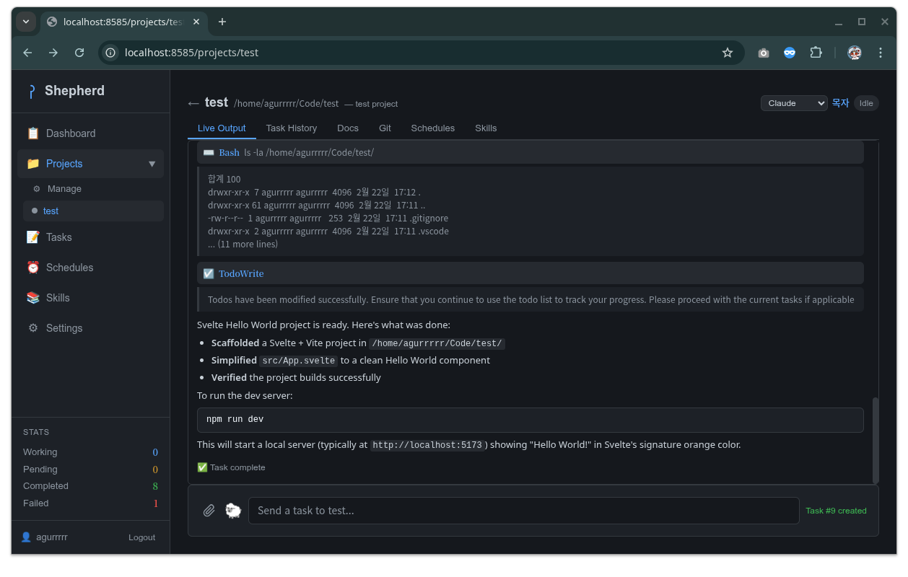

# Shepherd

AI coding orchestration CLI that manages multiple Claude Code sessions — like a shepherd tending a flock.

> For Korean version, see [README_KO.md](README_KO.md).

## Overview

Shepherd lets you run multiple AI coding agents simultaneously across different projects. It provides three interfaces to manage your flock:



- **CLI** — Interactive chat mode and direct commands
- **Web UI** — Full-featured dashboard with real-time streaming
- **MCP Server** — Integration with Claude Desktop and other MCP clients

### Core Concepts

- **Shepherd (Manager)**: Analyzes tasks and routes them to the right worker
- **Sheep (Workers)**: Individual Claude Code instances, each assigned to a project
- **Projects**: Codebases that sheep work on

> **No API keys needed.** Shepherd delegates all AI work to the Claude Code CLI, which handles its own authentication.

## Requirements

- **Go 1.21+** (to build)
- **Node.js 18+** (for Web UI build)
- **Claude Code CLI** installed and available in `PATH`

## Installation

### Quick Install

```bash
# Clone and build everything (CLI + Web UI + daemon)
git clone https://github.com/agurrrrr/shepherd.git
cd shepherd
./install.sh
```

The install script builds the Svelte frontend, compiles the Go binary, installs to `~/.local/bin/`, and starts the daemon.

### Manual Build

```bash
go build -o shepherd ./cmd/shepherd
cp shepherd ~/.local/bin/
```

## Quick Start

```bash
# 1. Initialize the current directory as a project
shepherd init

# 2. Set up authentication (for Web UI)
shepherd auth setup

# 3. Start the daemon
shepherd serve -d

# 4. Open the Web UI
#    http://localhost:8585

# 5. Or use the interactive CLI
shepherd
```

### One-Liner Task

```bash
shepherd "Add login feature to the app"
```

---

## Interactive Mode

Running `shepherd` with no arguments enters an interactive chat mode:

```bash
$ shepherd
🐑 Shepherd (my-project) > Add dark mode support
🐑 Shepherd (my-project) > status
🐑 Shepherd (my-project) > #42
```

**Built-in commands:**

| Command | Description |
|---------|-------------|
| `help`, `?` | Show available commands |
| `status` | System overview |
| `projects` | List projects |
| `flock` | List sheep |
| `log`, `history` | Task history |
| `clear` | Clear screen |
| `#<id>` | View task details |
| `exit`, `quit`, `q` | Exit |

---

## Daemon & Server

Shepherd runs as a background daemon that serves both the Web UI and REST API.

```bash
shepherd serve                # Foreground (for development)
shepherd serve -d             # Background daemon
shepherd serve status         # Check daemon status
shepherd serve stop           # Stop daemon
```

**Flags:**

| Flag | Description | Default |
|------|-------------|---------|
| `-d`, `--daemon` | Run as background daemon | `false` |
| `--cors-origin` | Allowed CORS origins (comma-separated) | `*` |

**Environment variables:**

| Variable | Description |
|----------|-------------|
| `SHEPHERD_CORS_ORIGIN` | Allowed CORS origins (alternative to `--cors-origin`) |

**Files:**
- PID file: `~/.shepherd/shepherd.pid`
- Database: `~/.shepherd/shepherd.db`
- Config: `~/.shepherd/config.yaml`

### systemd Service (Optional)

```ini
# ~/.config/systemd/user/shepherd.service
[Unit]
Description=Shepherd AI Orchestration Daemon
After=network.target

[Service]
ExecStart=%h/.local/bin/shepherd serve
Restart=on-failure
RestartSec=5

[Install]
WantedBy=default.target
```

```bash
systemctl --user enable --now shepherd
```

---

## Authentication

Shepherd uses config-based single-user authentication with JWT tokens and bcrypt password hashing.

```bash
# Initial setup (interactive: username + password)
shepherd auth setup

# Change password
shepherd auth change-password
```

- JWT secret is auto-generated on first server start
- Access tokens expire in 24 hours, refresh tokens in 7 days
- API requests require `Authorization: Bearer <token>` header
- Health endpoint (`GET /api/health`) is public

---

## Web UI

The Web UI is a Svelte SPA embedded in the Go binary. Access it at `http://localhost:8585` after starting the daemon.

### Pages

| Page | Path | Description |
|------|------|-------------|
| Dashboard | `/` | Sheep status cards, running tasks, command input |
| Sheep | `/sheep` | Create, delete, change provider |
| Projects | `/projects` | Project list and management |
| Project Detail | `/projects/:name` | Git log, branches, docs, schedules, skills |
| Tasks | `/tasks` | Task list with filtering and search |
| Task Detail | `/tasks/:id` | Full output, modified files, error details |
| Schedules | `/schedules` | Cron/interval schedule management |
| Skills | `/skills` | Skill creation, import/export |
| Settings | `/settings` | Language, provider, configuration |
| Login | `/login` | Authentication |

### Real-Time Updates (SSE)

The Web UI receives live updates via Server-Sent Events:

```
GET /api/events?token=<access_token>
```

Events: `task_start`, `task_complete`, `task_fail`, `output`, `status_change`, `schedule_triggered`

### External Access via Ingress

For HTTPS access outside your network, use a reverse proxy (e.g., Nginx, Caddy) or Kubernetes Ingress with cert-manager.

---

## Commands Reference

### Sheep Management

```bash
shepherd spawn                    # Create sheep (auto-named)
shepherd spawn -n dolly           # Create with specific name
shepherd spawn -p vibe            # Create with Vibe provider
shepherd flock                    # List all sheep
shepherd recall <name>            # Terminate a sheep
shepherd recall --all             # Terminate all sheep
shepherd set-provider <name> auto # Change provider
```

### Project Management

```bash
shepherd init [name]                            # Register current directory
shepherd project add <name> <path> -d "desc"    # Add a project
shepherd project list                            # List projects
shepherd project remove <name>                   # Remove a project
shepherd project assign <project> <sheep>        # Assign a sheep
```

### Task Execution

```bash
shepherd "<task>"                 # Submit task (auto-routed by manager)
shepherd task "<task>"            # Explicit task command
```

### Task Queue

```bash
shepherd queue add <project> "<prompt>"                       # Add task to queue
shepherd queue list                                            # List pending tasks
shepherd queue import-issues <project> <YouTrackProject> [query]  # Import from YouTrack
```

### Browser Automation

```bash
shepherd browser open <url> [-s sheep] [--headless]   # Open URL
shepherd browser get-text <selector> [-s sheep]       # Extract text
shepherd browser get-html [--selector <sel>]           # Get HTML
shepherd browser screenshot [path] [--selector <sel>]  # Capture screenshot
shepherd browser fetch <url> [--selector <sel>]        # Fetch and extract content
shepherd browser list [-s sheep]                        # List open pages
shepherd browser close [-s sheep]                       # Close session
```

### Status & Logs

```bash
shepherd status                   # System overview
shepherd log                      # Full task log
shepherd log <sheep> -n 50        # Logs for a specific sheep
shepherd history <project>        # Project task history
```

### Sheep Names

```bash
shepherd names list               # List custom names
shepherd names add Dolly Shaun    # Add custom names
shepherd names remove Dolly       # Remove a name
```

### Configuration

```bash
shepherd config get <key>         # Get a config value
shepherd config set <key> <val>   # Set a config value
shepherd config path              # Show config file path
```

### Other

```bash
shepherd tui                      # Terminal UI dashboard
shepherd recover                  # Recover stuck sheep/tasks
shepherd mcp                      # Run as MCP server
shepherd --version                # Show version
```

---

## Scheduling

Schedules are managed via the Web UI (`/schedules`) or REST API. Two types are supported:

- **Cron**: Standard cron expressions (e.g., `0 9 * * MON-FRI`)
- **Interval**: Run every N seconds

```
POST /api/projects/:name/schedules
GET  /api/schedules/preview?cron=0 9 * * *    # Preview next 5 run times
POST /api/projects/:name/schedules/:id/run    # Trigger immediately
```

Schedules automatically create tasks at the configured times.

---

## Skills

Skills are reusable prompt templates that can be attached to projects or used globally. Managed via the Web UI (`/skills`) or REST API.

- **Global skills**: Available to all projects
- **Project skills**: Scoped to a specific project
- **Bundled skills**: Pre-installed default skills (auto-seeded on first startup)
- **Import/Export**: Share skills as files

```
GET  /api/skills                    # List global skills
POST /api/skills/import             # Import from file
GET  /api/skills/:id/export         # Export to file
```

---

## Configuration

Config file: `~/.shepherd/config.yaml`

```yaml
language: en               # en, ko
default_provider: claude   # claude, vibe, auto
max_sheep: 12              # Maximum concurrent sheep
db_path: ~/.shepherd/shepherd.db
log_level: info            # debug, info, warn, error
server_port: 8585
server_host: 0.0.0.0
auto_approve: true

# Authentication (set via 'shepherd auth setup')
auth_username: admin
auth_password_hash: "$2a$10$..."
auth_jwt_secret: "auto-generated"
```

---

## Architecture

```
User Input → Interactive CLI / Web UI / MCP Client
          → Shepherd Daemon (REST API + SSE)
          → Manager (analyzes intent via Claude Code CLI)
          → Routes to appropriate sheep
          → Worker runs Claude Code (--print [--resume SESSION_ID])
          → Queue records result
          → Real-time updates via SSE → all connected clients
```

### Multi-Provider Support

| Provider | CLI | Use Case |
|----------|-----|----------|
| `claude` | Claude Code | Default — code writing, complex tasks |
| `vibe` | Mistral Vibe | Reviews, web search, simple tasks |
| `auto` | Auto-select | Analyzes prompt and picks the best provider |

### Project Structure

```
shepherd/
├── cmd/shepherd/          # CLI entrypoint (~2000 lines, all commands)
├── ent/schema/            # Ent ORM entities (Sheep, Project, Task, Skill, Schedule)
├── internal/
│   ├── agent/             # AI provider abstraction (Claude, Vibe)
│   ├── browser/           # Browser automation (Rod)
│   ├── config/            # Viper-based YAML config
│   ├── daemon/            # PID file, signal handling, lifecycle
│   ├── db/                # SQLite database
│   ├── i18n/              # Internationalization (en, ko)
│   ├── manager/           # Task analysis & routing
│   ├── mcp/               # JSON-RPC 2.0 MCP server
│   ├── names/             # Sheep name pool
│   ├── project/           # Project CRUD
│   ├── queue/             # Task lifecycle management
│   ├── scheduler/         # Cron & interval scheduling
│   ├── server/            # Fiber HTTP server, SSE, auth, handlers
│   ├── skill/             # File-based skill system
│   ├── tui/               # Bubbletea terminal UI
│   └── worker/            # Sheep execution & session management
└── web/                   # Svelte SPA (JavaScript only, no TypeScript)
```

---

## REST API

All endpoints (except auth and health) require JWT authentication.

### Auth
```
POST /api/auth/login               # Returns access + refresh tokens
POST /api/auth/refresh             # Refresh access token
```

### Resources
```
GET|POST         /api/sheep                    # List / Create
GET|DELETE       /api/sheep/:name              # Get / Delete
PATCH            /api/sheep/:name/provider     # Update provider

GET|POST         /api/projects                 # List / Create
GET|DELETE       /api/projects/:name           # Get / Delete
POST             /api/projects/:name/assign    # Assign sheep

GET|POST         /api/tasks                    # List / Create
GET              /api/tasks/:id                # Get details
POST             /api/tasks/:id/stop           # Stop running task
```

### Git (Read-Only)
```
GET /api/projects/:name/git/log                # Commit history
GET /api/projects/:name/git/branches           # Branches
GET /api/projects/:name/git/commits/:hash      # Commit detail
GET /api/projects/:name/git/commits/:hash/diff # Commit diff
GET /api/projects/:name/git/changes            # Uncommitted changes
```

### Schedules & Skills
```
GET|POST         /api/projects/:name/schedules      # List / Create
GET|PATCH|DELETE /api/projects/:name/schedules/:id   # CRUD
POST             /api/projects/:name/schedules/:id/run  # Trigger now

GET|POST         /api/skills                    # List / Create global
POST             /api/skills/import             # Import
GET|PATCH|DELETE /api/skills/:id                # CRUD
GET              /api/skills/:id/export         # Export
GET|POST         /api/projects/:name/skills     # Project-scoped skills
```

### System
```
GET  /api/health                   # Health check (public)
GET  /api/system/status            # System stats
POST /api/system/restart           # Restart daemon
GET  /api/events                   # SSE stream
POST /api/command                  # Natural language command
POST /api/upload                   # File upload (10MB limit)
```

---

## MCP Server

Run Shepherd as an MCP server for integration with Claude Desktop:

```json
{
  "mcpServers": {
    "shepherd": {
      "command": "shepherd",
      "args": ["mcp"]
    }
  }
}
```

**Available MCP tools:** `task_start`, `task_complete`, `task_error`, `get_history`, `get_status`, and 20+ browser automation tools (`browser_open`, `browser_click`, `browser_type`, `browser_screenshot`, etc.)

---

## Sheep Names

Default name pool (Korean sheep names):

양동이, 양말이, 양철이, 양순이, 메에롱, 깜순이, 흰둥이, 복실이, 숀, 뭉치, 구름이, 몽실이

Add custom names with `shepherd names add <name>`.

---

## Error Handling & Recovery

- **Auto-recovery**: Stuck sheep and tasks are recovered on daemon/TUI startup
- **Manual recovery**: `shepherd recover`
- **Graceful shutdown**: Handles SIGINT/SIGTERM, saves state before exit
- **Timeouts**: 60 sec (task analysis), 30 min (interactive execution)

---

## Development

```bash
go build ./...                              # Build all packages
go test ./...                               # Run all tests
go test ./internal/worker -run TestName     # Run specific test
go generate ./ent                           # Regenerate Ent ORM code

cd web && npm install && npm run dev        # Web UI dev server
cd web && npm run build                     # Web UI production build
```

## Contributing

See [CONTRIBUTING.md](CONTRIBUTING.md) for guidelines.

## License

MIT License — see [LICENSE](LICENSE) for details.

---

> ***"The Lord is my shepherd; I shall not want."*** — Psalm 23:1
